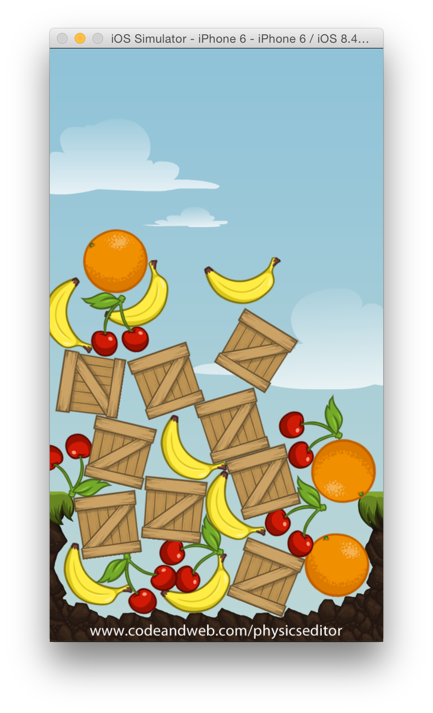

# Cocos2d Physics Demo

This is the source code for the [Cocos2d Physics Tutorial](https://www.codeandweb.com/physicseditor/tutorials/cocos2d-physics-tutorial) by CodeAndWeb.

## Checking out the source code 

Cocos2d is integrated as git submodule - this makes updating cocos2d to a newer version easy. 

When cloning the project use the following command line - this will automaticall load all depencencies:


```
git clone --recursive https://github.com/CodeAndWeb/cocos2d-physics-example
```




